
<h1 align="center">景海中学教学管理系统分析与设计</h1>

## 简介
景海中学教学管理系统：角色分为管理员、用户；功能包括用户管理、考试信息管理、考试成绩管理、课程信息管理、公告管理等，多模块协同提升学校教学管理效率。    --计算机毕业设计源码；毕设源码；java毕业设计源码

## 联系方式

<h3 align="center">获取完整代码与数据库文件 + 微信：deepguan QQ: 86050149 QQ群: 783742310</h3>

<h3 align="center">可帮忙远程部署 包运行成功！提供远程部署、修改代码、设计文档指导、代码讲解等服务！</h3>

## 功能介绍（完整见运行截图）
管理员：管理员在景海中学教学管理系统中可以进行全局管理，包括管理员信息管理、教师管理、用户管理、考试信息管理、课程信息管理、考试成绩管理、基础数据管理以及公告管理。管理员可以通过系统界面进行用户账户的新增、修改、删除以及查看，同时可以批量删除用户信息并管理公告类型。此外，管理员有权限查看和操作考试成绩信息，管理课程和公告的发布与更新。

教师：教师可访问教学管理系统，管理个人信息并查看与自己相关的考试信息和成绩。教师可通过界面搜索考试标题、学科及学生信息，以便查阅和评估考试结果。教师能够上传和管理与课程相关的资料，并在公告管理模块查看学校发布的通知。

学生：学生用户能够通过系统查看个人成绩和考试信息，个人中心允许学生管理和更新基本信息如手机号和邮箱。系统提供简洁的界面，方便学生查询特定考试的时间、地点和详细内容。此外，学生登录后可以查看与自己相关的考试成绩和公告。

其他用户：其他用户或学校工作人员可以利用系统的基本功能模块，如用户管理、考试信息维护、课程管理和公告发布。系统界面设计注重简洁性和用户体验，帮助学校高效开展教学管理工作。公告管理模块允许用户上传文件和编辑公告内容，确保教育资源和信息的及时上传和发布。

## 运行截图
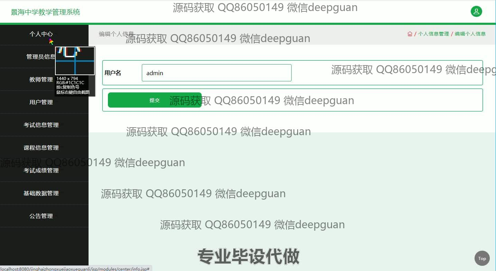
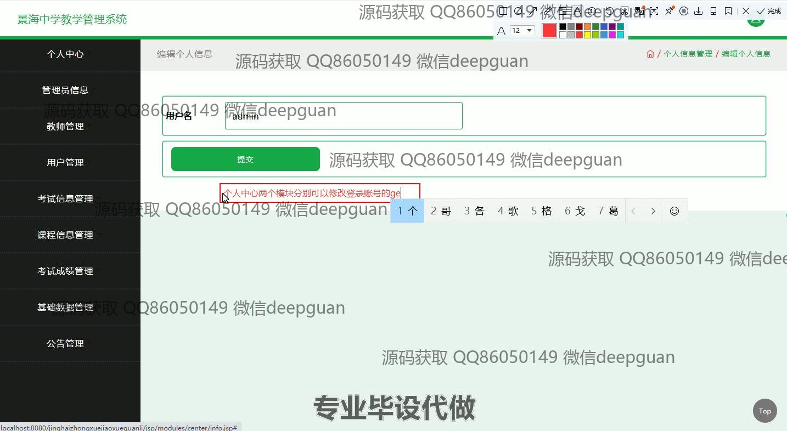
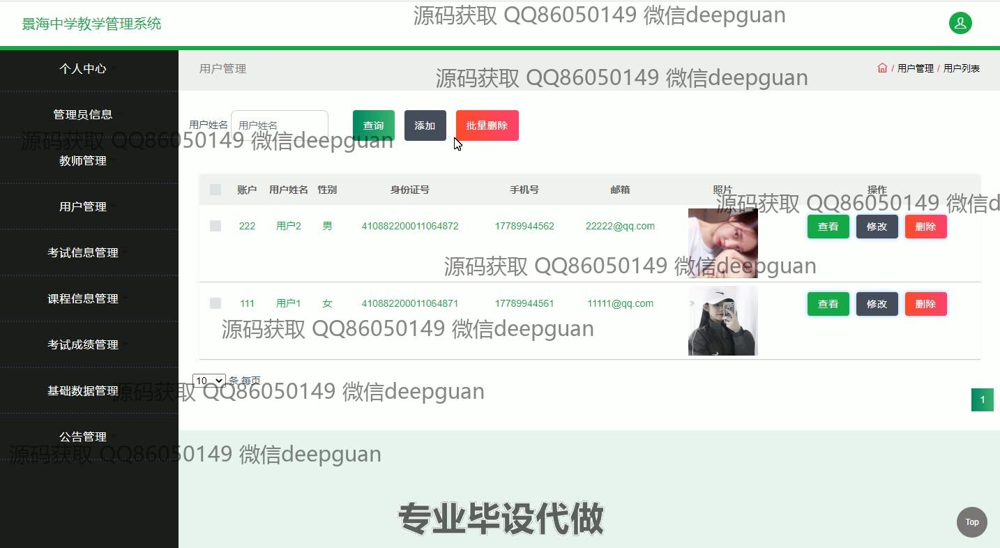
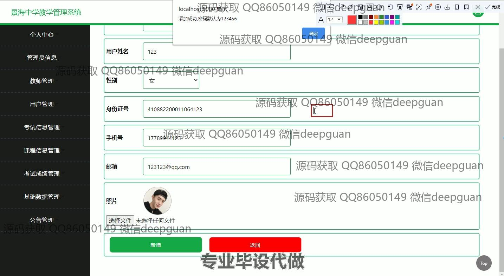
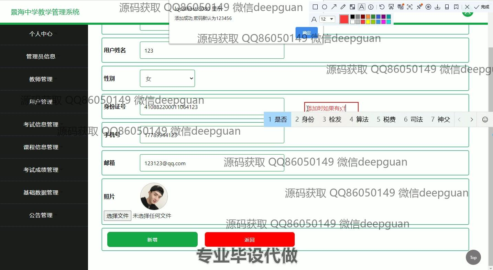
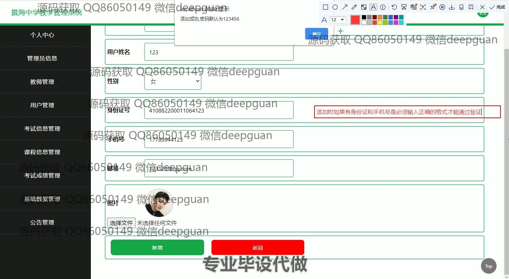
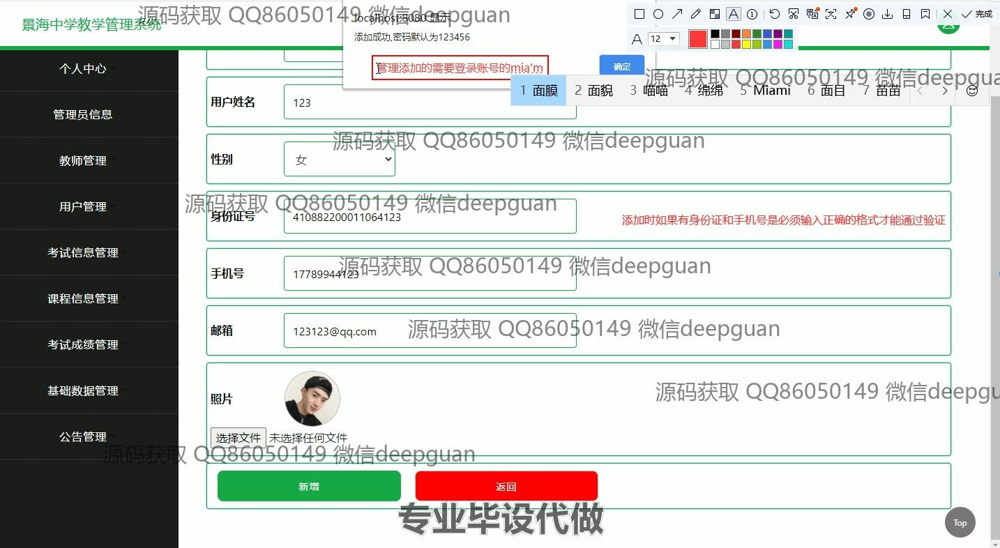

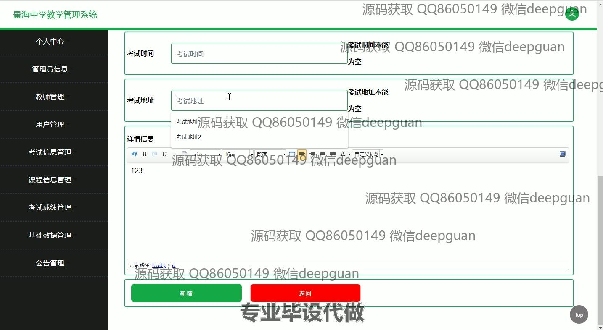
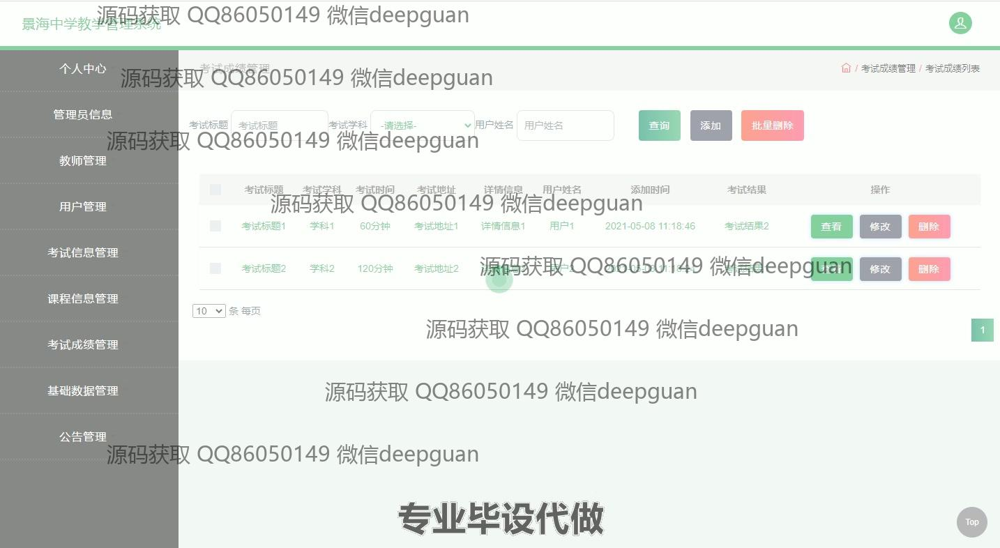
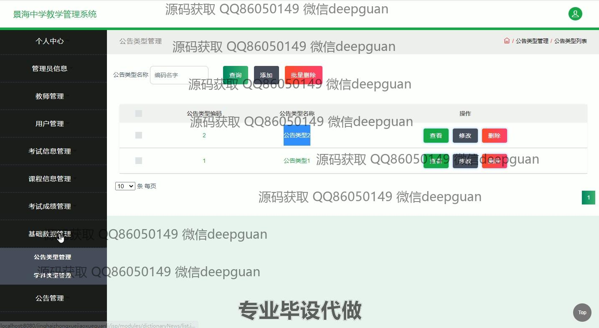
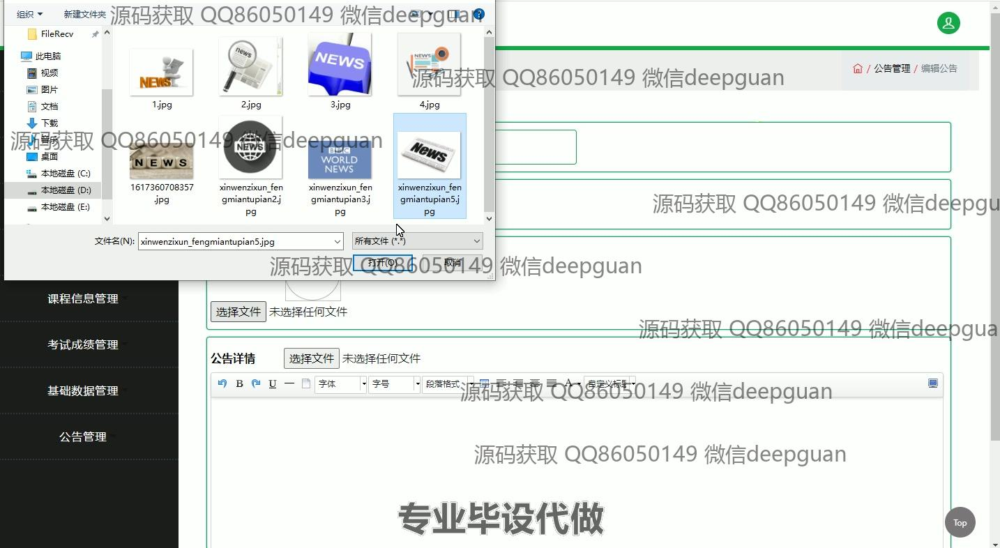
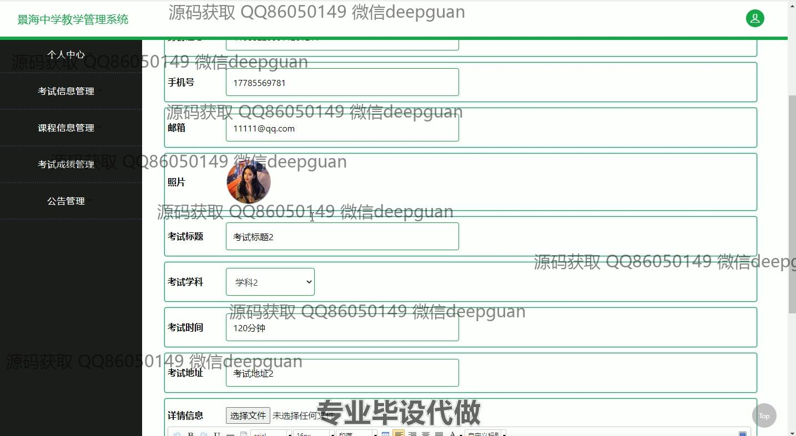
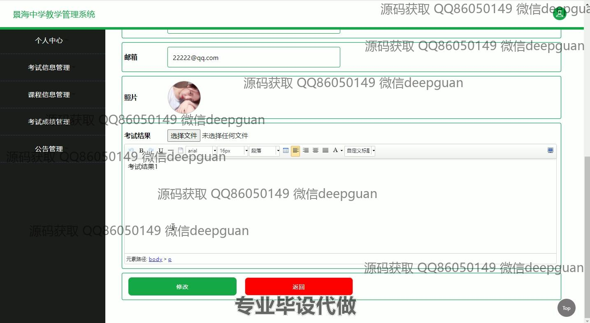
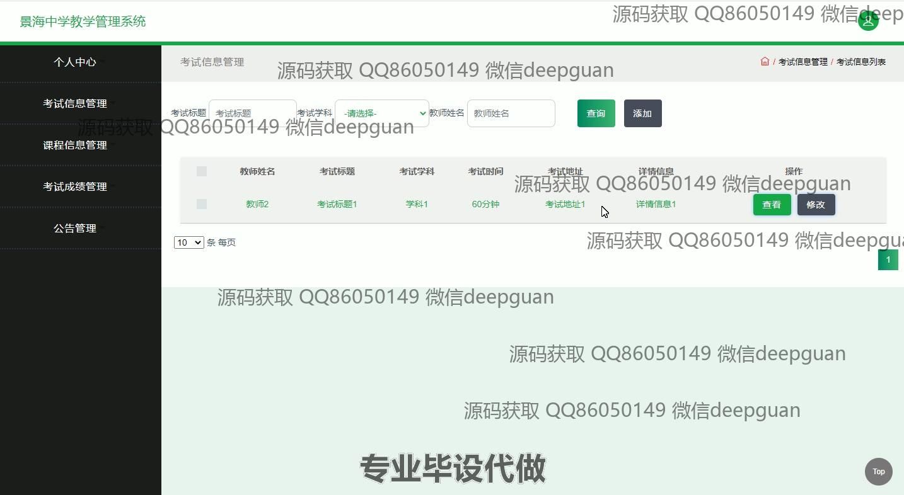
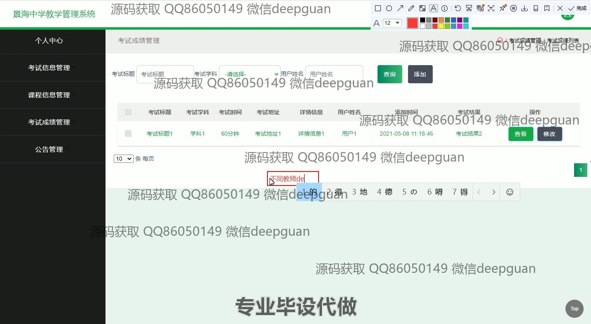
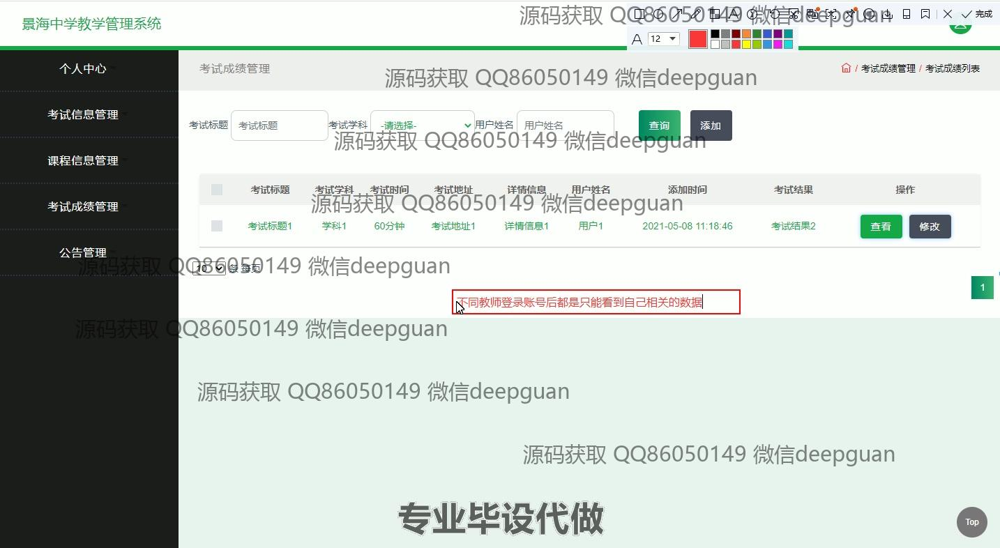
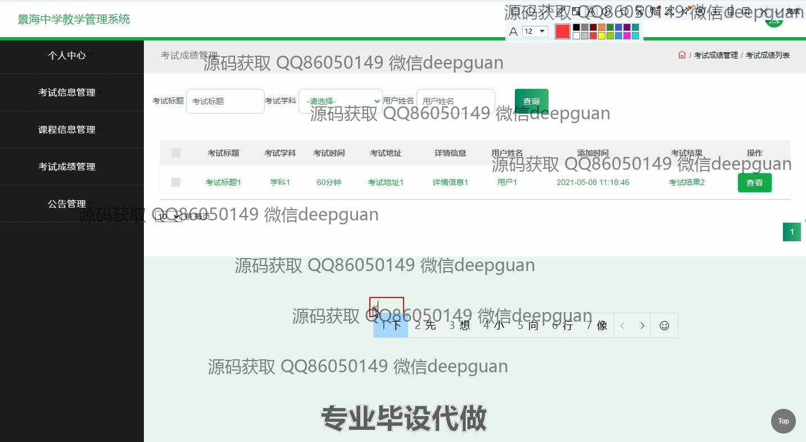
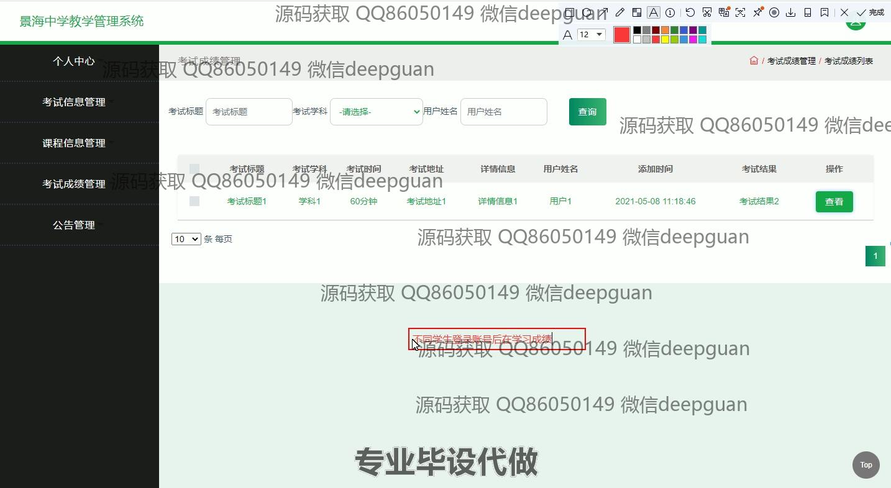
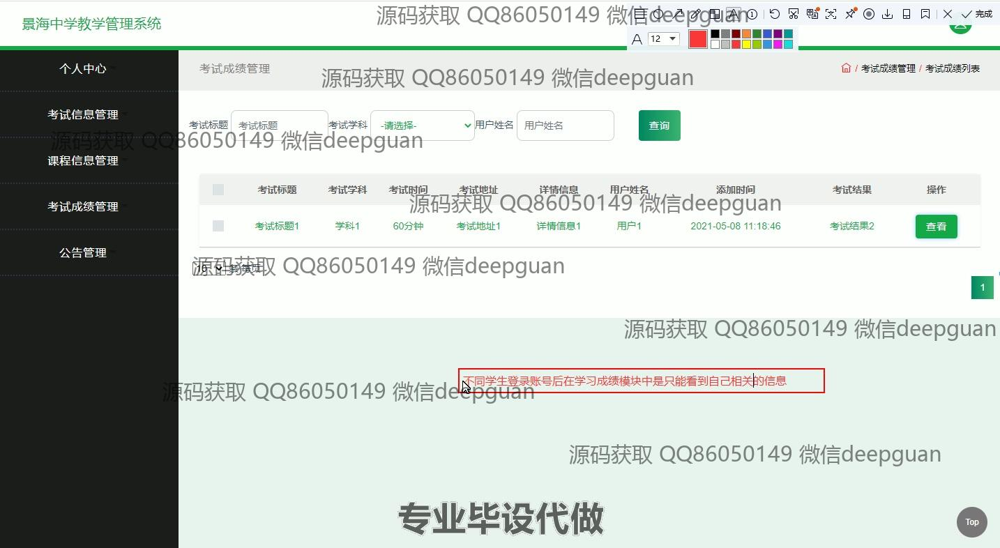

本代码来源于网络,仅供学习参考使用!

